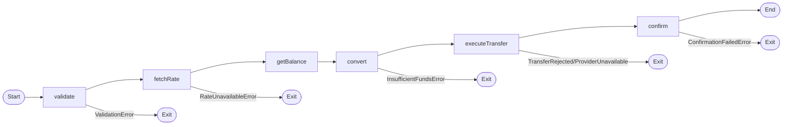

# Money Transfer API Stories

## tests/integration/send-money.msw.story.test.ts

### Send Money Workflow (MSW)

### ✅ sendMoney uses rates from mocked api-rates

- **Given** a valid transfer request for £100 GBP to EUR with MSW mocking the rates API
- **When** the workflow runs end-to-end
- **Then** the transfer completes with €117.00 using the mocked rate 1.17
    **Transfer Result**
    
    ```json
    {
      "transferId": "TXN-000001",
      "convertedAmount": 117,
      "rate": 1.17
    }
    ```
    

## tests/integration/send-money.spans.story.test.ts

### Send Money Workflow (autotel spans)

### ✅ produces the full span tree for a successful transfer

- **Given** autotel uses TestSpanCollector for trace capture
- **When** the sendMoney workflow runs for 100 GBP to EUR
- **Then** the full workflow span tree is recorded
    > Total spans: 8
    > Span names: validate, fetchRate, getBalance, convert, executeTransfer, confirm, sendMoney, POST /api/transfer

### ✅ records validation attributes on the validate span

- **Given** autotel uses TestSpanCollector for trace capture
- **When** a 250 EUR to USD transfer is validated
- **Then** the validate span contains transfer attributes
    > Validate span attributes: {
  "transfer.recipient_iban": "GB29NWBK60161331926819",
  "transfer.amount": 250,
  "transfer.from_currency": "EUR",
  "transfer.to_currency": "USD",
  "validation.status": "passed"
}

## tests/unit/convert-currency.story.test.ts

### Convert Currency

### ✅ converts 100 GBP to EUR at rate 1.17

`conversion`
- **Given** a balance of £500 and an exchange rate of 1.17
- **When** 100 GBP is converted to EUR
- **Then** it returns €117.00

### ✅ returns InsufficientFundsError when balance too low

`conversion`
- **Given** a balance of £500 but wanting to send £1000
- **When** 1000 GBP is converted to EUR
- **Then** it returns InsufficientFundsError with required and available amounts

### ✅ rounds to 2 decimal places

`conversion`
- **Given** a balance of £500 and an exchange rate of 1.17
- **When** 33 GBP is converted to EUR
- **Then** the result is rounded to 38.61

## tests/unit/fetch-rate.story.test.ts

### Fetch Rate

### ✅ returns exchange rate for a supported pair

`rates`
- **Given** a rates API is available with GBP/EUR at 1.17
- **When** the exchange rate for GBP to EUR is fetched
- **Then** it returns the correct rate of 1.17

### ✅ returns RateUnavailableError when rates API fails

`rates`
- **Given** the rates API is down
- **When** the exchange rate is fetched
- **Then** it returns a RateUnavailableError

### ✅ returns RateUnavailableError when pair is missing from the matrix

`rates`
- **Given** the rates matrix has no entry for GBP to USD
- **When** the exchange rate for GBP to USD is fetched
- **Then** it returns RateUnavailableError for the missing pair

## tests/unit/send-money-workflow.story.test.ts

### Send Money Workflow

### ✅ workflow overview

**Money Transfer Workflow**

End-to-end transfer steps and error branches.

**Transfer Railway**

**Error Summary**

```json
{
  "steps": [
    "validate",
    "fetchRate",
    "getBalance",
    "convert",
    "executeTransfer",
    "confirm"
  ],
  "errorsByStep": {
    "validate": [
      "ValidationError"
    ],
    "fetchRate": [
      "RateUnavailableError"
    ],
    "convert": [
      "InsufficientFundsError"
    ],
    "executeTransfer": [
      "TransferRejectedError",
      "ProviderUnavailableError"
    ],
    "confirm": [
      "ConfirmationFailedError"
    ]
  }
}
```


### ✅ happy path: send £100 GBP → EUR

`workflow`
- **Given** a valid transfer request for £100 GBP to EUR with rate 1.17 and balance £10000
- **When** the workflow runs end-to-end
- **Then** the transfer completes with €117.00
    **Transfer Result**
    
    ```json
    {
      "transferId": "TXN-001",
      "convertedAmount": 117,
      "rate": 1.17
    }
    ```
    

### ✅ exits early on validation error

`workflow`
- **Given** an IBAN that is too short
- **When** the workflow runs
- **Then** it exits at the validate step with ValidationError

### ✅ exits early on rate unavailable

`workflow`
- **Given** the rates API is down
- **When** the workflow runs
- **Then** it exits at the fetchRate step with RateUnavailableError

### ✅ exits early on insufficient funds

`workflow`
- **Given** the user has £50 but wants to send £100
- **When** the workflow runs
- **Then** it exits at the convert step with InsufficientFundsError

## tests/unit/validate-transfer.story.test.ts

### Validate Transfer

### ✅ accepts valid transfer input

`validation`
- **Given** a user provides valid transfer details
- **When** the input is validated
- **Then** validation succeeds with validated transfer data

### ✅ rejects invalid IBAN

`validation`
- **Given** a user provides an IBAN that is too short
- **When** the input is validated
- **Then** validation fails with a ValidationError

### ✅ rejects same source and target currency

`validation`
- **Given** a user tries to transfer GBP to GBP
- **When** the input is validated
- **Then** validation fails — from and to currencies must differ

### ✅ spec by example — validation rules

`validation`
**Validation Examples**

| IBAN | Amount | From | To | Valid? | Reason |
| --- | --- | --- | --- | --- | --- |
| bad | 100 | GBP | EUR | false | IBAN too short |
| DE89370400440532013000 | -10 | GBP | EUR | false | Negative amount |
| DE89370400440532013000 | 100 | GBP | GBP | false | Same currency |
| DE89370400440532013000 | 100 | GBP | EUR | true | All valid |